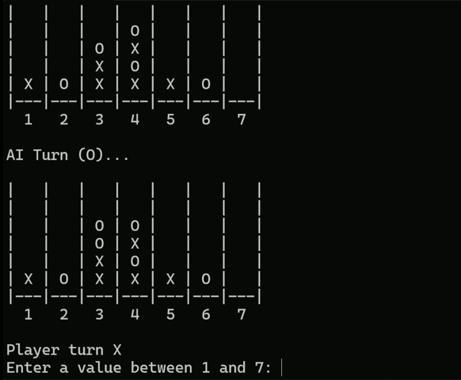

<div align="center">

# connect4engine

[](#)
[](LICENSE)
[](#)
[](#)

A highly optimized, bitboard-based Connect 4 artificial intelligence engine written in C++. 

Built from the ground up to beat human players and solve positions in real-time limits (under 5 seconds per move). Uses a custom implementation of the **Negamax algorithm**, with alpha-beta pruning, transposition tables, and iterative deepening, as well as a similar to the Universal Chess Interface (UCI) protocol for automated testing and GUI integration.



---

</div>

## ✨ Key Features

- **Fast Bitboards:** 
  The board state is compactly encoded using two 64-bit integers (position and mask), allowing for fast state updates and O(1) instantaneous win detection using optimized bitwise operations.
- **Negamax with Alpha-Beta Pruning:** 
  Drastically scales down the search space by mathematically eliminating branches proven to be suboptimal.
- **Transposition Tables & Zobrist Hashing:** 
  Memory-efficient caching of previously evaluated positions, preventing redundant calculations and significantly increasing the effective search depth.
- **Iterative Deepening:** 
  Progressively searches deeper and deeper into the game tree, guaranteeing a highly robust move recommendation within strict time controls and significantly upgrading the ordering logic.
- **Heuristic Move Ordering:** 
  Evaluates the most promising logical moves first (e.g., center columns prioritization and examining Principal Variation nodes from earlier searches) to hit alpha-beta cutoffs as quickly as possible.
- **UCI-Compatible Interface Mechanism:** 
  An adaptation of the standard Universal Chess Interface protocol, permitting flawless integration with GUI systems and sophisticated external testing environments.
- **Extensive Python Test Harness:** 
  Includes a feature-rich Python suite designed to run tournaments, test specific engine builds (historic versions), execute benchmarks, and dynamically generate detailed markdown reports profiling AI strength and speed.

---

## 🏗️ Project Structure

```text
connect4engine/
├── connect4engine/      # Core C++ engine, game board representation, TUI, and UCI interface mechanisms
├── tests/               # Python test harness (datasets, tournaments, automated benchmarking and reporting)
├── engines/             # Executable engine versions mapping the project's historical progression
├── CMakeLists.txt       # Build system configuration
└── README.md            
```

### Architecture Overview

- **`tauler.cpp` / `tauler.h`:** 
  Encapsulates the board logic, making effective use of the aforementioned dense bitboard mechanics.
- **`ia.cpp` / `ia.h`:** 
  Houses the intelligence side of the project—coordinating the Negamax search architecture and iterative deepening control loops.
- **`transposition_table.cpp`:** 
  A lockless, robust Zobrist hashing caching layer essential for retaining depth metrics securely.
- **`uci.cpp`:** 
  Translates external command pipelines into internal parameters mapped directly to the engine core components.
- **`tests/`:** 
  Uses standard datasets to evaluate AI logic progression against test sets consisting of hundreds of specific puzzle scenarios (`run_benchmark.py`).

---

## 🚀 Getting Started

### Prerequisites

- A **C++17** compliant compiler (MSVC, GCC, or Clang)
- **CMake** (3.10 or higher recommended)
- **Python 3.8+** (Optional, intended exclusively for running the test harness suite)

### Building the Project

1. **Clone the repository:**
   ```bash
   git clone https://github.com/marcprogcode/connect4engine.git
   cd connect4engine
   ```

2. **Generate build files and compile:**
   ```bash
   mkdir build
   cd build
   cmake ..
   
   # Build the project (Release mode heavily recommended for performance metrics)
   cmake --build . --config Release
   ```

### Running the Engine

You can run the engine in two distinct interaction modes:

**1. Interactive CLI (TUI Mode)**
Test your might and play directly against the AI straight from your terminal:
```bash
./Release/connect4engine.exe   # On Windows
./connect4engine               # On Linux/macOS
```

**2. UCI Mode**
Launch the engine strictly for communication via standard I/O (often preferred for bots, debugging pipelines, or advanced API integrations):
```bash
./Release/uci.exe              # On Windows
./uci                          # On Linux/macOS
```

---

## 📈 Performance & Evolution

The engine has undergone continual benchmarking, currently **solving 87%+ of Connect 4 dataset positions correctly**. It consistently reaches a search depth of **32+ ply in under 30ms** on standard modern PC hardware. 

Over its development lifecycle, this project advanced through 9 major milestone iterations, each progressively layering deeper optimization capabilities on top of base logic constraints. 

For an in-depth analytical breakdown profiling speed adjustments and win rates across versions, consult the full [**Engine Evolution Report**](engines/README.md).

<div align="center">
  
</div>

---

## 🤝 Contributing & Support

Contributions, issue reports, and major feature requests are completely welcome! Feel free to visit the [Issues Tracking page](https://github.com/marcprogcode/connect4engine/issues) if you spot any bugs or want to implement improvements to the engine functionality.

## 📄 Licensing Information

This engine project is distributed under the terms of the MIT License, granting free usage to all. See the [LICENSE](LICENSE) file for explicit details.
