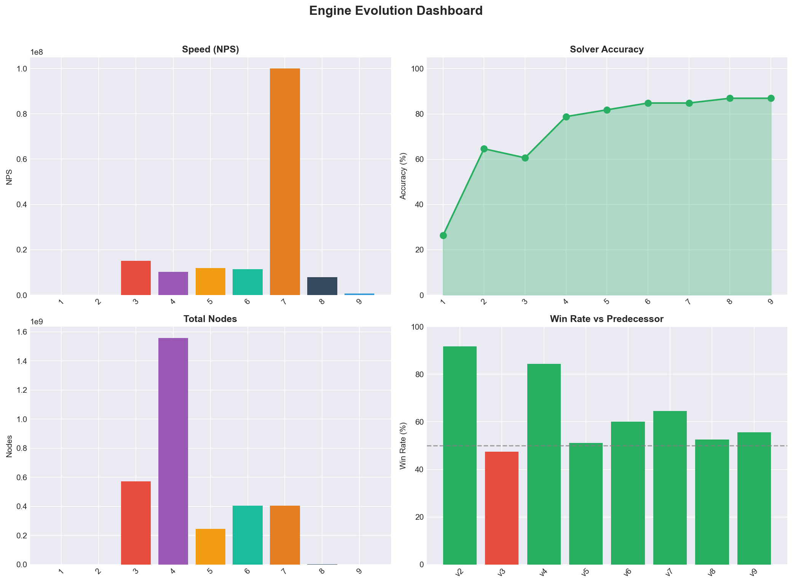
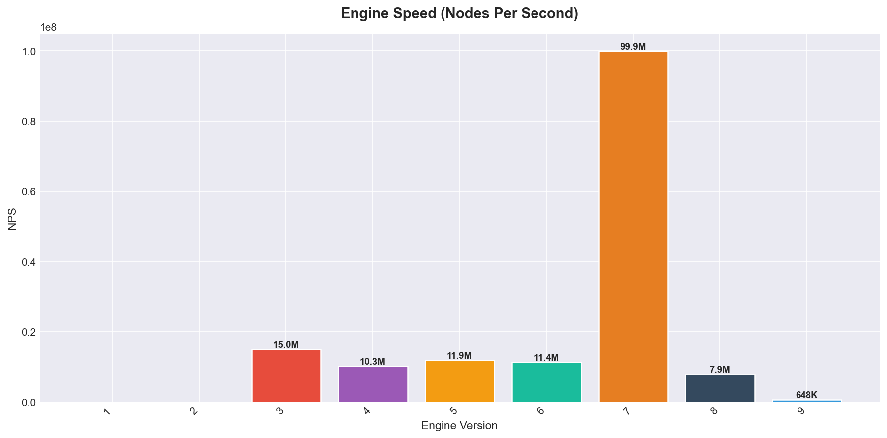
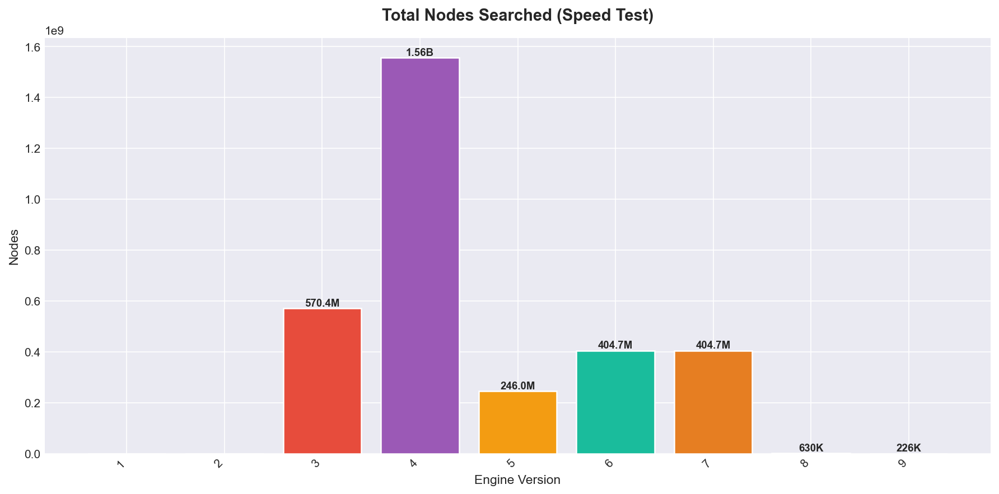

# Connect 4 Engine Evolution Report

## Summary

- **Fastest Engine**: 7_bitboard (99,922,976 NPS)
- **Most Accurate**: 9_forced_lines (86.9%)
- **Total Elo Gain**: +933 (v1 → latest)

This report details the systematic evolution of a Connect 4 engine through 9 major iterations. What began as a simple random-move generator evolved into a highly optimized, bitboard-based Negamax engine augmented with alpha-beta pruning, transposition tables, and iterative deepening. The total +933 Elo gain demonstrates how code and computational optimizations compound to create a significantly stronger AI.

## Dashboard

## 1. Engine Versions & Performance Summary

This table summarizes key metrics for each engine iteration.
- **NPS (Nodes Per Second)**: Measures raw computational speed. Higher is better.
- **Solver Accuracy**: Percentage of test positions correctly solved. Higher is better.
- **Avg Depth**: How many plies (half-moves) ahead the engine can calculate. Deeper is better.

| Engine | NPS | Nodes | Solver Accuracy | Avg Depth | Avg Time |
| :--- | ---: | ---: | ---: | ---: | ---: |
| **1_randomMove** | 0 | N/A | 26.3% | 7.0 | N/A |
| **2_win_block_center_random** | 0 | N/A | 64.6% | 7.0 | N/A |
| **3_negamax** | 15,010,971 | 570,431,212 | 60.6% | 7.0 | 3ms |
| **4_negamax_scoremap** | 10,271,862 | 1,556,939,665 | 78.8% | 7.0 | 12ms |
| **5_negamax_scoremap_ordering** | 11,914,009 | 245,972,242 | 81.8% | 7.0 | 5ms | 
| **6_time_depth** | 11,351,064 | 404,726,739 | 84.8% | 17.5 | 6ms | 
| **7_bitboard** | 99,922,976 | 404,726,739 | 84.8% | 22.4 | 33ms | 
| **8_transposition** | 7,899,334 | 630,168 | 86.9% | 28.9 | 28ms | 
| **9_forced_lines** | 648,240 | 226,100 | 86.9% | 32.3 | 26ms | 

### Evolutionary Milestones & Implementation Details
1. **v1 to v2 (Heuristics)**: Introduced basic rules (win immediately, block opponent, prefer center). Accuracy jumped from 26% to 64% with negligible computational cost.
2. **v3 to v5 (Minimax & Alpha-Beta)**: Implementation of Negamax search. 
   - *v4* added a static position evaluator (scoremap/WEIGHTS array), drastically increasing accuracy by increasing the value of stones that enable more possible connect 4 patterns.
   - *v5* added move ordering (looking at center column moves first). This made alpha-beta pruning more efficient; by finding strong center moves early, massive branches of the search tree proven to be worse get completely ignored, cutting average time from 12ms to 5ms. Testing showed that for this particular engine, a simple, static move ordering without any complex calculations showed that it gave the best speed to reward ratio. Center moves are chosen first because they are statistically the most likely to lead to have a connect 4 pattern.
3. **v6 (Iterative Deepening)**: Allowed the engine to progressively search deeper within a fixed time budget. Average depth jumped from 7 to 17.5.
4. **v7 (Bitboards)**: A complete architectural rewrite to represent the board using two 64-bit integers instead of an array. This allowed for the use of bitwise operations to check for wins and other board states, which is much faster than using loops. NPS nearly 10x, reaching ~100 million nodes per second.
5. **v8 (Transposition Tables)**: With the speed increase from v7, the engine now had more performance budget to spend on refining the search algorithm. Introduced Zobrist Hashing to cache previously seen positions. Connect 4 has massive move transposition (the same board state reached by a different sequence of moves). By dynamically generating canonical and mirrored Zobrist keys, the engine can recall evaluations across symmetrical boards. If an identical branch had previously been searched to an equal or greater depth, the evaluation is pulled from memory.
6. **v9 (Forced Lines)**: Refined move ordering and search behavior to execute 1-ply wins and unconditionally block 1-ply opponent threats without engaging the rest of the Negamax subtree. This targeted logic bypassing acts alongside the TT cache. By cutting down the significantly the amount of leaf nodes the engine has to evaluate, it can explore branches more efficiently.

Note: The massive drop in raw NPS and Nodes searched for v8 and v9 is intentional. The engine selectively skips millions of redundant mathematical calculations, swapping them for near-instant memory hits. This allowed the average search depth within the same time limit to jump from 22.4 plies to 32.3+ plies, dramatically improving endgame playing strength.

## 2. Visualizations

### Speed Comparison

### Nodes Searched

### Accuracy Improvement

### Solver Timing

## 3. Head-to-Head Progression

Each version was tested against its predecessor in 200-game matches (100 openings × 2 colors). The Elo rating is calculated based on the win rate.

### Match Results

| Matchup | Wins | Losses | Draws | Win Rate | Elo Δ |
| :--- | ---: | ---: | ---: | ---: | ---: |
| **2_win_block_center_random** vs 1_randomMove | 123 | 11 | 0 | 91.8% | +419 |
| **3_negamax** vs 2_win_block_center_random | 55 | 62 | 17 | 47.4% | -18 |
| **4_negamax_scoremap** vs 3_negamax | 112 | 20 | 2 | 84.3% | +292 |
| **5_negamax_scoremap_ordering** vs 4_negamax_scoremap | 59 | 56 | 19 | 51.1% | +8 |
| **6_time_depth** vs 5_negamax_scoremap_ordering | 73 | 46 | 15 | 60.1% | +71 |
| **7_bitboard** vs 6_time_depth | 81 | 42 | 11 | 64.6% | +104 |
| **8_transposition** vs 7_bitboard | 65 | 58 | 11 | 52.6% | +18 |
| **9_forced_lines** vs 8_transposition | 72 | 57 | 5 | 55.6% | +39 |

### Elo Progression

## 4. Solver Analysis

The solver test suite subjects the engine to 99 complex, pre-defined board states to evaluate its analytical correctness under pressure. To determine the correct move, a strong solver was used on those positions, and the engine's move was compared to the solver's move.

### Timing Statistics

| Engine | Tested | Correct | Failed | Avg Depth | Min Time | Avg Time | Max Time |
| :--- | ---: | ---: | ---: | ---: | ---: | ---: | ---: |
| 1_randomMove | 99 | 26 | 73 | 7.0 | 0ms | 0ms | 8ms |
| 2_win_block_center_random | 99 | 64 | 35 | 7.0 | 0ms | 0ms | 7ms |
| 3_negamax | 99 | 60 | 39 | 7.0 | 0ms | 3ms | 110ms |
| 4_negamax_scoremap | 99 | 78 | 21 | 7.0 | 0ms | 12ms | 185ms |
| 5_negamax_scoremap_ordering | 99 | 81 | 18 | 7.0 | 0ms | 5ms | 150ms |
| 6_time_depth | 99 | 84 | 15 | 17.5 | 0ms | 6ms | 15ms |
| 7_bitboard | 99 | 84 | 15 | 22.4 | 0ms | 33ms | 59ms |
| 8_transposition | 99 | 86 | 13 | 28.9 | 0ms | 28ms | 82ms |
| 9_forced_lines | 99 | 86 | 13 | 32.3 | 0ms | 26ms | 253ms |

## 5. Speed Test Details

This test measures the raw Nodes Per Second (NPS) the engine can process in specific benchmark positions.

| Engine | 44 | 443355 | Empty | 
| :--- | ---: | ---: | ---: | 
| 1_randomMove | N/A | N/A | N/A |
| 2_win_block_center_random | N/A | N/A | N/A |
| 3_negamax | 14.8M | 12.9M | 15.0M |
| 4_negamax_scoremap | 10.9M | 10.0M | 10.3M |
| 5_negamax_scoremap_ordering | 11.8M | 11.5M | 11.9M |
| 6_time_depth | 11.3M | 11.0M | 11.4M |
| 7_bitboard | 91.2M | 69.1M | 99.9M |
| 8_transposition | 18.1M | 41.0M | 7.9M |
| 9_forced_lines | 14.5M | 184K | 648K |
