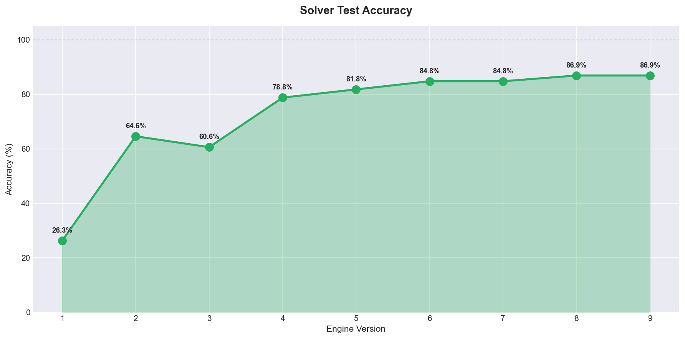
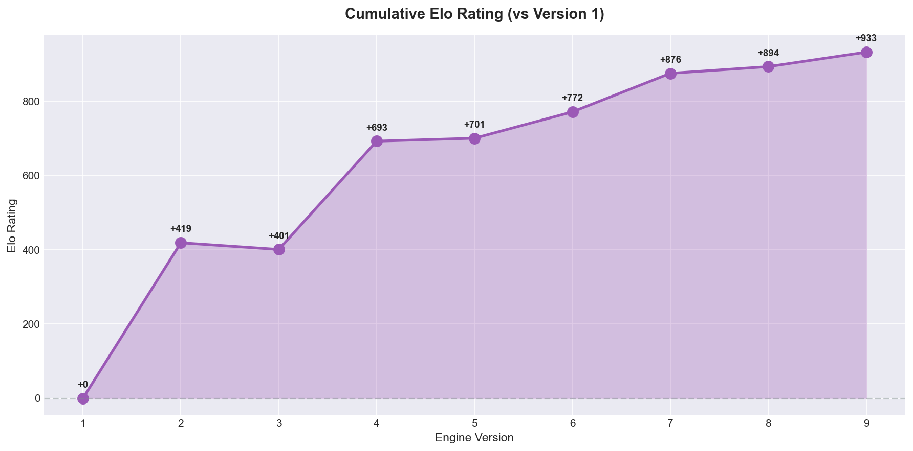
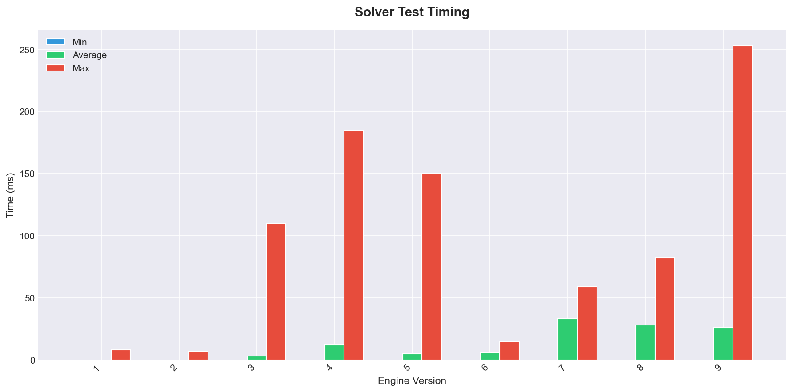
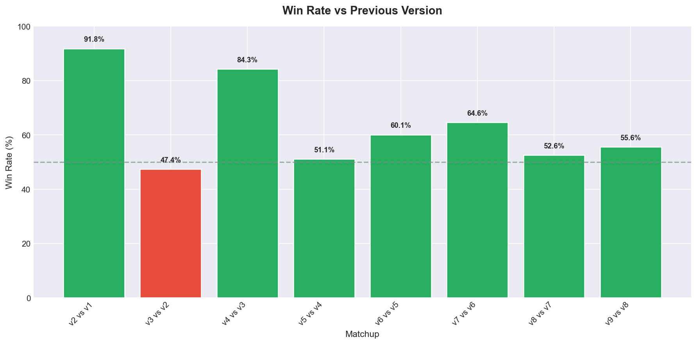

<div align="center">

# 🧪 Connect 4 Test Infrastructure

[](#)
[-success.svg?style=flat-square)](#)

A robust, fully-featured testing framework explicitly built to benchmark, evaluate, and profile the Connect 4 engine. 

Designed without any external dependencies, this suite handles automated performance checking, regression testing, and Engine vs. Engine competitive tournaments.

</div>

---

## 🎯 Test Suite Capabilities

- **Automated Benchmarking (`run_benchmark.py`):** Execute rapid, objective tests for node generation speed (NPS), position solving accuracy against curated datasets.
- **Tournament Manager (`run_tournament.py`):** Pit different versions of the engine against each other in automated series, using predefined opening books to enforce varied starting positions.
- **Dynamic Time Control Testing:** Test engine time management, measuring exact `movetime` metrics versus adaptive clock management (`wtime / btime`).
- **UCI Protocol Compatibility:** Automatically wraps the engine subprocess, sending and parsing Universal Chess Interface style standard I/O streams.

---

## 📁 Directory Structure

```text
tests/
├── datasets/
│   └── test_positions.txt      # Manually curated library of specific board states and their known best moves
├── openings/
│   └── balanced_openings.txt   # Starting permutations to enforce fair but varied tournament matches
├── engine_wrapper.py           # Core subprocess controller; acts as the I/O bridge to the engine
├── run_benchmark.py            # CLI tool for objective QA testing (solver, speed, perft metrics)
├── run_tournament.py           # CLI tool for staging Engine vs Engine combat
└── requirements.txt            # Python dependencies (currently empty; relies strictly on the standard library)
```

---

## ⚙️ Prerequisites

1. **A UCI-enabled executable**: The targeted engine must be built and able to accept basic UCI commands (`position`, `go wtime btime`, `go depth`, `quit`).
2. **Python Environment**: Python 3.8+ installed.

---

## 🚀 Usage Guide

### 1. Running Benchmarks

Evaluate the engine's objective strength, correctness, and speed:

```bash
# Run the complete test suite (solver + speed)
python tests/run_benchmark.py --engine build/Release/uci.exe --test all

# Run only the Solver Test (Tests move accuracy against test_positions.txt)
python tests/run_benchmark.py --engine build/Release/uci.exe --test solver --time 3000

# Run only the Speed Test (Measures raw Nodes Per Second rate)
python tests/run_benchmark.py --engine build/Release/uci.exe --test speed --depth 12
```

#### Benchmark Argument Reference

| Flag | Description | Default |
| :--- | :--- | :--- |
| `--engine` | **(Required)** Path to the compiled engine executable | `None` |
| `--test` | Test module to run (`solver`, `speed`, `all`) | `all` |
| `--depth D` | Maximum strict search depth for speed/perft | `8` |
| `--time MS` | Max time per position (in ms) for solver | `2000` |
| `--positions N` | Cap on the number of dataset positions to test | `100` |

---

### 2. Running Tournaments

Pits two builds of the engine against one another. Highly customizable via depth caps and precise time controls.

```bash
# Standard Depth-Limited Match (Good for analyzing logic improvements independent of speed constraints)
python tests/run_tournament.py --engine1 build/Release/uci.exe --engine2 engines/BASE.exe --depth1 10 --depth2 9

# Time-Limited Match (Forces engines to rely on Iterative Deepening logic)
python tests/run_tournament.py --engine1 build/Release/uci.exe --engine2 engines/BASE.exe --depth1 42 --time 1000

# Handicap Match (Different time limits per engine)
python tests/run_tournament.py --engine1 build/Release/uci.exe --engine2 engines/8_transposition.exe --time1 100 --time2 500
```

> [!IMPORTANT]  
> **Time Management Behavior (`movetime` vs `wtime/btime`)**
> 
> By default, `run_tournament.py` sends `wtime/btime` (remaining game clock). The engine interprets this and allocates only a fraction (~3%) of that time per move to avoid flagging. 
> 
> If you want the engine to think for a *guaranteed standard amount of time* on every single move, append the `--movetime` flag to your tournament execution command.

---

### 3. Generating Automated Reports

The `report.py` script is a high-level tool that automates the benchmarking process and generates a polished, detailed Markdown report (much like `engines/README.md`). It runs the engine through defined test suites, tracks historical progress, and formats the output into an easy-to-read document with automatic graphical visualizations.

**This is the cornerstone of the testing framework.** It generates graphs tracking ELO progression, win rates, nodes per second, and solver accuracy.

```bash
# Run the full testing suite and generate a new report
python tests/report.py

# Generate a report instantly from a pre-existing tournament/benchmark JSON log
python tests/report.py --from-log path/to/log.json
```

#### Example Output Visualizations

| Accuracy & Timing | ELO & Winrates |
| :---: | :---: |
|  |  |
|  |  |

---

## 🔌 UCI Protocol Hooks

For `engine_wrapper.py` to correctly communicate with your executable, your engine must parse the following STDIN strings:

| Inbound Command | Expected Action |
| :--- | :--- |
| `position [moves]` | Set internal board to the exact move sequence (e.g. `position 4453`). Empty string `""` clears the board. |
| `go wtime [ms]` | Initiate search factoring in total time remaining on the clock. |
| `go movetime [ms]` | Initiate search to last exactly `[ms]` milliseconds. |
| `go depth [d]` | Initiate search limited precisely to depth level `[d]`. |
| `quit` | Gracefully exit the application loop. |

**Outbound Expected Responses**:

| Outbound String | Meaning |
| :--- | :--- |
| `info depth [X] score [Y] nodes [Z]` | Outputs periodic search heuristics. Read dynamically by the tester. |
| `bestmove [1-7]` | Signifies the engine has finalized its decision and the turn is passed. |

---

## 🛠 Adding New Test Data

The suite consumes strictly formatted `.txt` files in the subdirectories.

**Testing New Positions (`datasets/test_positions.txt`)**
Add lines in the format: `[Move sequence string] [Known best next move]`
```text
4433556 4
44553 3
```

**Testing New Openings (`openings/balanced_openings.txt`)**
Add lines in the format: `[Opening move sequence (ideally 4-8 ply)]`
```text
443355
445544
```
